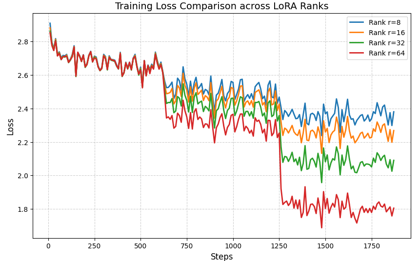
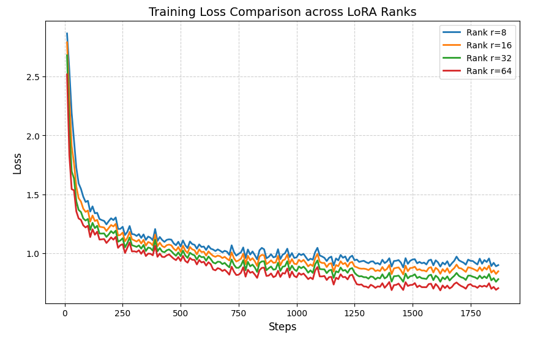
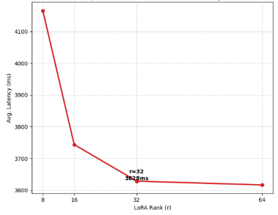
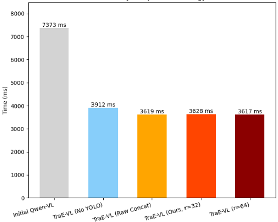
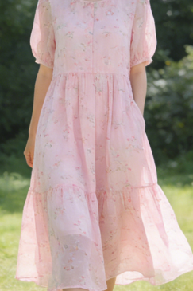
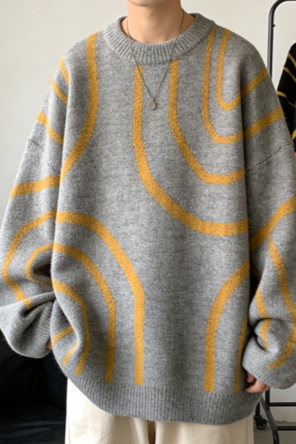

<script src="https://polyfill.io/v3/polyfill.min.js?features=es6"></script>
<script id="MathJax-script" async src="https://cdn.jsdelivr.net/npm/mathjax@3/es5/tex-mml-chtml.js"></script>

# Supplementary Material for TraE-VL

---

## Appendix A: Dynamic Task Vocabulary Extraction Examples
**Label: app:vocabulary**

This appendix demonstrates the deconstructive mapping relationship from AdGen and ZERO raw attribute strings to TraE-VL visual perception labels. Zero-shot fine-grained recognition is implemented using YOLO-World, transforming text into physical entity anchors.

### Visual label extraction mapping representation

| Raw Attribute String (Content) | Extracted Visual Labels ($V_{task}$) | Label Dimension |
| :--- | :--- | :--- |
| Type#Pants*Silhouette#Loose*Style#Wide-leg | Wide-leg pants, Loose silhouette, Linear texture | Silhouette |
| Type#Skirt*Style#Mermaid*Sleeveless | Mermaid skirt, Stripes, Sleeveless design | Details |
| Type#Top*Style#Hoodie*Irregular | Pink hoodie, Letter print, Irregular cut | Category |
| Type#Skirt*Material#Chiffon*Style#A-line | Chiffon fabric, A-line dress | Material |
| Type#Top*Collar#Polo*Splicing | Polo collar, Short sleeves, Splicing design | Craftsmanship |
| Type#Top*Material#Silk*Small stand collar | Silk shirt, Small stand collar, Contrast stripes | Details |
| Industrial tourism site*Xinjiang*Mining culture*Architectural elements\#Mine shaft | Mine shaft, Industrial heritage, Mining equipment | -- |
| Museum*Nanjing*Southern Dynasty tomb murals*Architectural elements\#Pictorial bricks | Pictorial bricks, Murals, Artifact display cases | -- |
| Urban landscape*Cuba*Exotic atmosphere*Architectural elements\#Vintage car | Vintage car, Street scenery | -- |
| Ancient village*Shanxi Jincheng*Millennium-old village*Architectural elements\#Shilang Fortress | Bluestone paths, Ming-Qing courtyards, Brick carvings | -- |
| Museum*Gansu Province*Silk Road culture*Bronze Galloping Horse | Bronze Galloping Horse, Exhibition hall | -- |

---

## Appendix B: LoRA Hyperparameter Selection and Efficiency Analysis
**Label: app:lora**

To determine the optimal LoRA rank configuration, this study systematically validates the comprehensive impact of $r \in \{8, 16, 32, 64\}$ on training convergence speed, inference efficiency, and model performance.

### Training Convergence Characteristics

Figure 1 presents the training loss evolution curves under different ranks. On the Base AdGen dataset, loss decreases as $r$ increases, but with diminishing marginal returns, indicating that $r=16$ can already effectively learn task features. Notably, the stylized dataset exhibits significant rapid convergence characteristics—loss drops precipitously within the first 250 steps, fully validating the effectiveness of LoRA's low-rank decomposition assumption: the model requires fine-tuning only 0.2% of parameters to rapidly adapt to the target style, demonstrating exceptional parameter efficiency.

<div align="center">
  
  
  <p><i>Fig 1. Training loss convergence curves under different LoRA ranks. (Left: Base AdGen dataset; Right: AdGen stylized dataset)</i></p>
</div>

### Nonlinear Relationship Between Inference Latency and Rank Parameters

Figure 2 comprehensively demonstrates the impact patterns of LoRA rank on inference latency across three datasets and performance comparisons of different configurations. The experiments reveal a complex nonlinear relationship between inference efficiency and rank parameters, with this relationship significantly modulated by dataset characteristics.

<div align="center">
  
  
  <p><i>Fig 2. Comprehensive impact of LoRA rank parameters on inference latency: Cross-dataset comparative analysis.</i></p>
</div>

**Counter-intuitive Phenomenon on AdGen Dataset.** As rank increases from 8 to 64, inference latency actually decreases from 4180ms to 3617ms, a reduction of 13%. This counter-intuitive phenomenon stems from the constraining effect of explicit semantic anchors on the decoding space: larger ranks enable the model to more fully leverage anchor information, effectively narrowing the search range of candidate word distributions, thereby accelerating convergence to reasonable outputs. Furthermore, the end-to-end latency of the complete TraE-VL framework (3617ms) outperforms all ablation versions, empirically validating significant synergistic effects between LoRA parameterization and explicit anchoring mechanisms.

**Domain Adaptation Differences in ZERO Dataset.** In stark contrast to AdGen, the ZERO dataset exhibits distinctly different latency patterns. Dataset1 shows non-monotonic variation (reaching lowest at approximately 3626ms when $r=64$), while on Dataset2, differences across configurations converge, with the version without YOLO being slightly faster. The underlying reason lies in the high visual homogeneity of the ZERO dataset—the repetitiveness of scenes such as ancient architecture and natural landscapes, combined with low resolution, enables the model to fully learn domain priors during the training phase. For such typical scenarios (e.g., "Guilin landscapes"), the model can rapidly generate generic descriptions (requiring only approximately 0.1s), significantly lower than complex scenarios requiring fine-grained perception (2-3s). However, despite locally reduced inference latency, comprehensively considering the significant differences in perceptual accuracy (recall rate improvement of over 40 percentage points) and hallucination suppression effect (CHAIR$_i$ metric reduced to 0-2%), we strongly recommend retaining the YOLO module to ensure system robustness and generalization capability across diverse scenarios.

### Optimal Configuration

Comprehensively considering training convergence efficiency, inference latency performance, and downstream task performance, this paper selects $r=64$ as the optimal configuration. This parameter achieves an ideal balance across four key dimensions:

* **Expressive Capability**: In complex scenarios (stylized datasets, ZERO cross-domain datasets), $r=64$ significantly outperforms low-rank configurations in entity recall rate and text generation quality, demonstrating that sufficient rank capacity is crucial for capturing fine-grained semantics.
* **Training Efficiency**: Training loss converges to relatively low levels within the first 250 steps (Figure 1), indicating that larger ranks do not significantly increase training costs, achieving rapid adaptation.
* **Inference Efficiency**: Achieves lowest latency on the AdGen dataset (3617ms), attributed to more sufficient parametric expressive capability enabling the model to more efficiently leverage explicit anchors, accelerating decoding convergence.
* **Parameter Efficiency**: Trainable parameter count accounts for only 0.2% of total parameters, saving 99.80% of storage and computational overhead compared to full-parameter fine-tuning, greatly reducing deployment barriers.

From a computational complexity perspective, the additional inference overhead introduced by LoRA primarily stems from low-rank matrix multiplication, with complexity $O(dr)$, far smaller than the original attention layer's $O(d^2)$. Even under the $r=64$ configuration, additional computational overhead remains negligible (<0.2%). Considering the entity diversity in vertical domains (e-commerce scenarios contain hundreds of material and silhouette combinations) and the complexity requirements of stylized generation (balancing factual accuracy with marketing persuasiveness), adopting larger rank parameters ensures sufficient parametric expressive capability, representing the optimal choice for industrial deployment that balances performance, efficiency, and reliability.

---

## Appendix C: Prompt Template and Construction Details
**Label: app:prompts**

Three prompt strategies are compared to verify the guiding effect of explicit semantic anchors on generation.

| Strategy Name | Prompt Template (Prompt String) |
| :--- | :--- |
| **Baseline Strategy** | "Please write a marketing copy for vertical scenarios based on the image content." |
| **Label Concatenation** | `f"{tags}. Please write marketing copy based on the image content."` |
| **Natural Language Guidance** | `f"The system has identified the following image attributes: {tags}. Please write copy based on the content."` |


---

## Appendix D: Data Augmentation Details
**Label: app:data**

The Qwen model is utilized to perform style enhancement on a total of 10,000 high-quality samples, introducing marketing rhetoric and emoji symbols.
```python
def generate_stylized_summary(content):
    # Construct prompt with Xiaohongshu style requirements
    prompt = f"You are an experienced Xiaohongshu marketing blogger...Requirements: 
    Include emojis. Attributes: {content}"
    response = client.chat.completions.create(
        model="qwen-plus", 
        messages=[{"role": "user", "content": prompt}]
    )
    return response.choices[0].message.content.strip()
```

### Style Review and Judgment Criteria:
* **Emoji Density**: Copy must include symbols such as ❤️, ⭐, 🛒 to enhance persuasiveness.
* **Visual Atmosphere Description**: Frequent use of rhetoric such as 🪄 to simulate authentic blogger sharing habits.
* **Judgment Instructions**: Reviewers judge whether copy contains appropriate emojis and consumer guidance language following the "LLM-as-a-Judge" paradigm, outputting **[YES]** if conforming.

---

## Appendix E: Supplementary Qualitative Case Studies
**Label: app:cases**

This appendix provides supplementary qualitative comparisons of TraE-VL across different scenarios, further validating the model's generation stability under diverse styles. Additional cases are provided here for supplementary illustration.

<div align="center"> 
     
     
    <p><i>Fig 3. Supplementary cases for e-commerce fashion scenarios. (Left: Fine-grained attribute recognition case; Right: Fashion sweater case)</i></p> 
</div>

<div align="center"> 
     
     
    <p><i>Fig 4. Supplementary cases for cultural tourism scenarios. (Left: Object-level hallucination suppression case; Right: Forbidden City Hall of Supreme Harmony case)</i></p> 
</div>

### Case: Fashion Apparel Detail Recognition
In e-commerce scenarios, general-purpose models often produce generic descriptions. As shown in Figure 3, TraE-VL accurately identifies the material and silhouette of apparel:

* **Initial Qwen-VL (Generic Description)**: "On this sunny summer day, let us wear this light and flowing dress, feel the freshness and tranquility of nature, and become the most dazzling scenery in the meadow."
* **TraE-VL (Precise Recognition)**: "Summer breeze caressing, wearing this **chiffon dress**, as if entering a fairy tale world! ⭐ The fresh **A-line silhouette**, loose and flattering on all body types, **chiffon material** light and flowing, full of ethereal charm ~ 🍃 **Floral print** gentle and age-reducing, wearing it makes even the air sweeter ~ 🛒 Just go for it!"

### Case: Autumn Sweater Recognition
Figure 3 demonstrates TraE-VL's performance in fashion apparel scenarios. For autumn sweaters, the model accurately recognizes seasonal attributes and generates copy conforming to social media style:

* **Initial Qwen-VL**: "In this cold season, a warm and fashionable sweater is an essential item. This sweater uses comfortable fabric, soft and skin-friendly, with excellent warmth retention. The unique geometric pattern design is both simple and fashionable, easily handling daily wear or casual occasions. Paired with simple pants, you can easily create a fashionable yet personalized look. Come and purchase it, let this sweater become your warm companion in winter!"
* **TraE-VL (Ours)**: "⭐ **Autumn atmosphere outfit ceiling!** ⚡️ This contrasting color printed round-neck mid-length sweater, lazy and casual yet fashionable~ Sleeveless design super slimming, paired with high-waist pants directly slays the whole scene! ❤️ Casual trendy vibe mastered, casual wear makes you the street focus! 🛒 Just go for it!"

> **Note**: The comparison shows that TraE-VL accurately captures details such as "contrasting color print," "round neck," and "mid-length," while the baseline misidentifies the autumn sweater as a winter style, demonstrating the importance of fine-grained perception.

### Case: Professional Description of Historical Architecture
Figure 4 demonstrates the model's ability to identify specific landmarks after introducing YOLO-World entity labels.

* **TraE-VL w/o YOLO (Lacking Visual Anchors)**: 📍 A glimpse of millennia! The red-walled ancient temple is so stunning! 🏛️ Blue bricks and dark tiles, paired with the imposing stone lions, every casual shot is a masterpiece 📷 As if traveling back to the Tang Dynasty, the soul is at peace 🍃. #AncientStylePhotoSpot
* **TraE-VL (Explicit Visual Guidance)**: 📍 **Luoyang White Horse Temple**, a millennial Buddhist sanctuary at a glance! ⭐ Among red walls and dark tiles, the **Drum Tower** stands serenely, the **Reclining Jade Buddha Hall** tranquil and solemn, the **Qiyun Pagoda Courtyard** filled with lingering Zen ~ Every step treads upon historical echoes 🏛️ Coming to Luoyang, you must visit this source of Chinese Buddhist culture! 📈 #LuoyangTravel #WhiteHorseTemple

### Case: Hall of Supreme Harmony
Figure 4 presents the Hall of Supreme Harmony case. TraE-VL not only identifies specific building names but also incorporates professional descriptions such as "**mortise and tenon structure**," significantly outperforming the baseline's generic expressions:

* **Initial Qwen-VL**: "The magnificent scene of the imperial palace. Strolling through the vast expanse of the Forbidden City, the majestic palace before your eyes, resplendent in gold and jade, imposing and magnificent, with red walls and yellow tiles, solemn and dignified, every brick and tile narrates the precipitation of history."
* **TraE-VL (Ours)**: "📍 **Beijing Forbidden City·Hall of Supreme Harmony** | A glimpse of millennia, stunning beyond words! ⭐ Standing before the Hall of Supreme Harmony, as if traveling back to the prosperous Ming Dynasty 🏛️ **Mortise and tenon structure** requiring no nails or rivets, yet standing stable for 600 years! The solemn and mysterious red walls and golden tiles, every brick narrating ancient wisdom 🔥 Walking along the central axis, the soul finds peace 📷 Every casual shot is a masterpiece! #ForbiddenCityMustVisit #BeijingTravel"

> This case validates the effectiveness of the explicit anchoring mechanism in cultural tourism scenarios: by detecting the key landmark "Hall of Supreme Harmony," the model generates more targeted and professional descriptions rather than generic statements.
>
> 


